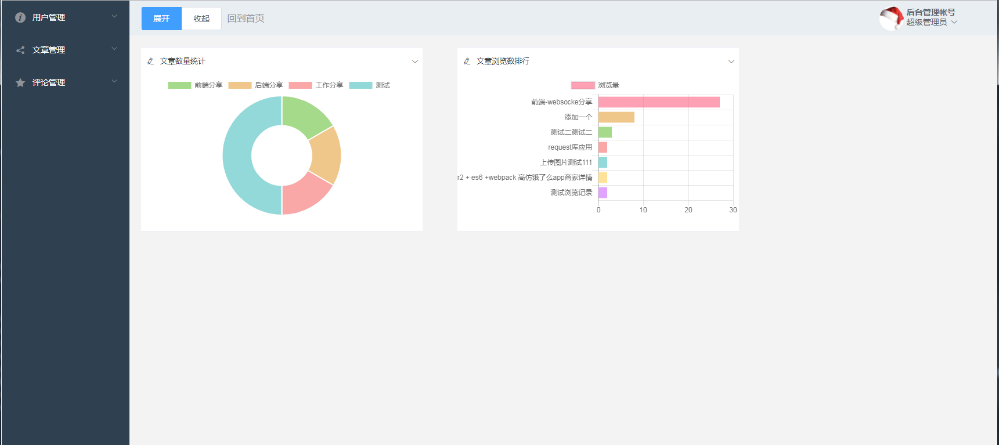

## 个人博客系统 --- 后台页面部分

> 分为三部分: 

1. 前台： 博客页面
2. 后台： 博客管理页面
3. 后台： 博客后台服务器

****

### 项目简介

> 项目已前后端分离开发。分别用到的框架如下:
* 前台页面用nuxt + axios开发
线上浏览地址: blog.gjwchaichai.pw
GITHUB源码地址:  [blog-website-nuxt](https://github.com/oxgos/blog-website-nuxt)

* 后台页面用vue2 + axios + vue-router + element-ui开发
线上浏览地址: blog-admin.gjwchaichai.pw
GITHUB源码地址:  [blog-admin](https://github.com/oxgos/blog-server-web)

* 后台服务器nodejs + express + mongodb开发
GITHUB源码地址:  [blog-server](https://github.com/oxgos/blog-server)

****

### 项目预览图





****

### 完成功能
1. 用户增删查改
2. 用户权限管理
3. 用户上传头像
4. 新增文章---mavon-editor富文本编辑器(markdown)
5. 编辑文章
6. 文章分类管理
7. 文章分类统计
8. 前台文章浏览数统计
9. 前台文章分页功能

****

### TODO
1. 博客注册功能
2. 用户评论管理功能
3. 评论提醒
4. 其它图表统计
5. Banner图管理功能

****

``` bash
# 安装项目依赖
npm install

# 启动项目于localhost:8080
npm run dev

# 项目打包
npm run build

# build for production and view the bundle analyzer report
npm run build --report
```
